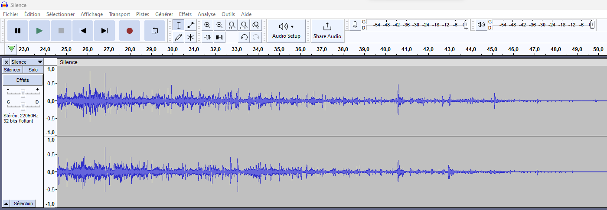
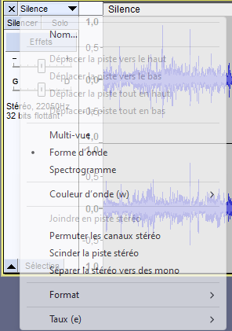
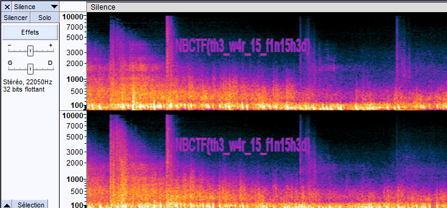

Il existe de nombreuses manières de cacher une information dans un fichier audio ! Commençons par ouvrir le fichier dans audacity.

La forme d'onde semble normale. La première chose à vérifier lorsqu'on fait de la stéganographie sur un audio est le spectrogramme. Pour ce faire :

Là ou "Frome d'onde" est sélectionné, on clique sur "Spectrogramme".

Plus qu'à recopier le flag !
