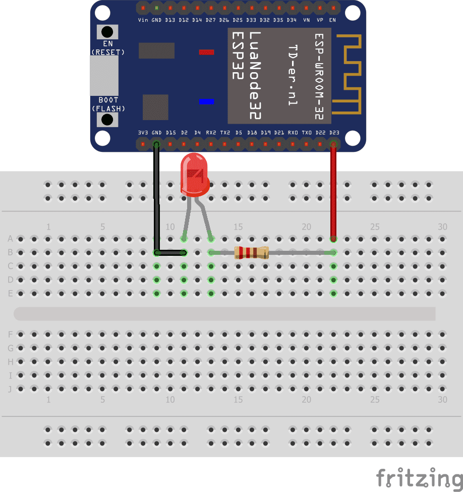

# Write-up Don't Blink Your Eyes

Bon, on a une carte, une brett board, et du matos. On sait que le message est transmis sur le pin GPIO 32, et le challenge parle de blink, c'est sûrement une LED.

On cherche donc "LED ESP32" sur google : 

Le montage est assez simple, on connecte le pin GPIO à une résistance suivie de la LED en série. L'autre broche est sur le GND.

On reproduit donc ce montage, et après quelques secondes la LED se met à clignoter. Les clignotements ont l'air réguliers, avec des longs des courts et des pauses. Tiens tiens tiens...

On obtient le code morse suivant : ".-.. ...-- -.. ..... ..--.- ....- .-. ...-- ..--.- -.-. ----- ----- .-.." ce qui, une fois traduit, donne L3D5_4R3_C00L.

D'où le flag : NBCTF{L3D5_4R3_C00L}

