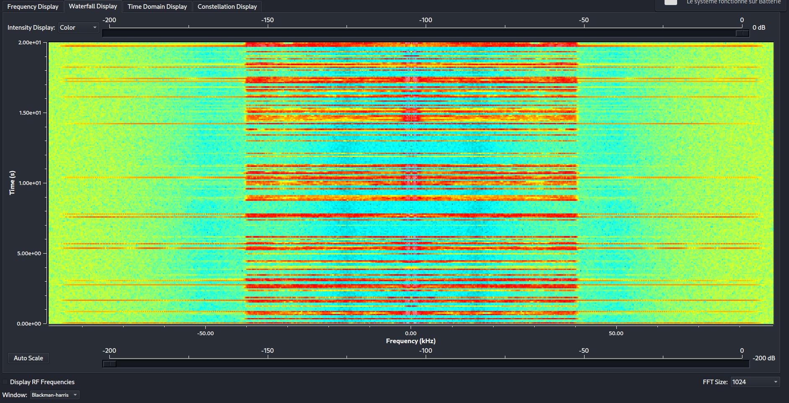
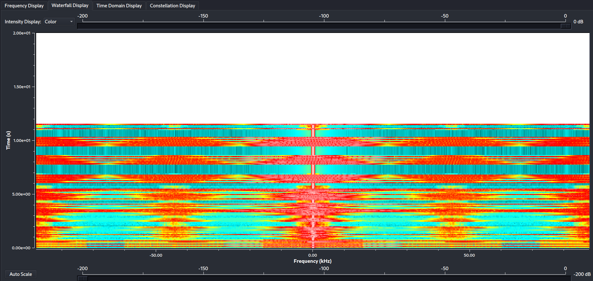
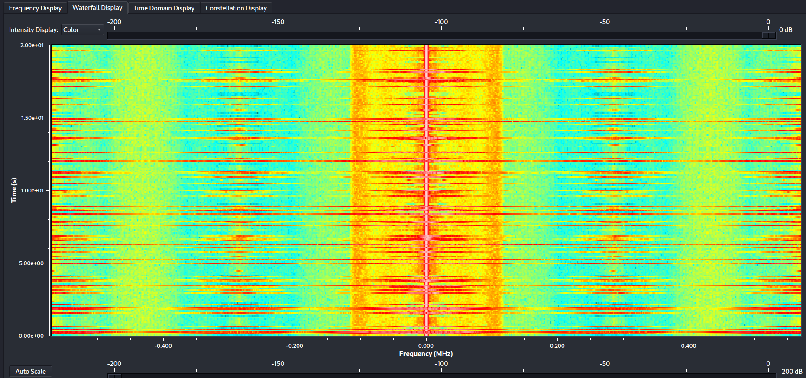
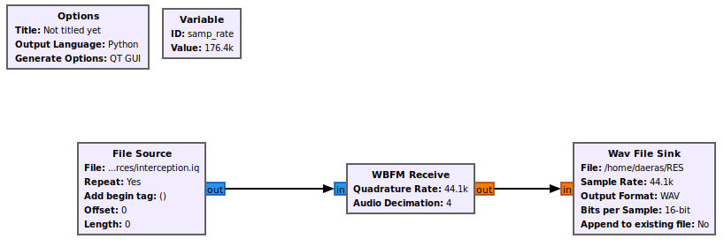
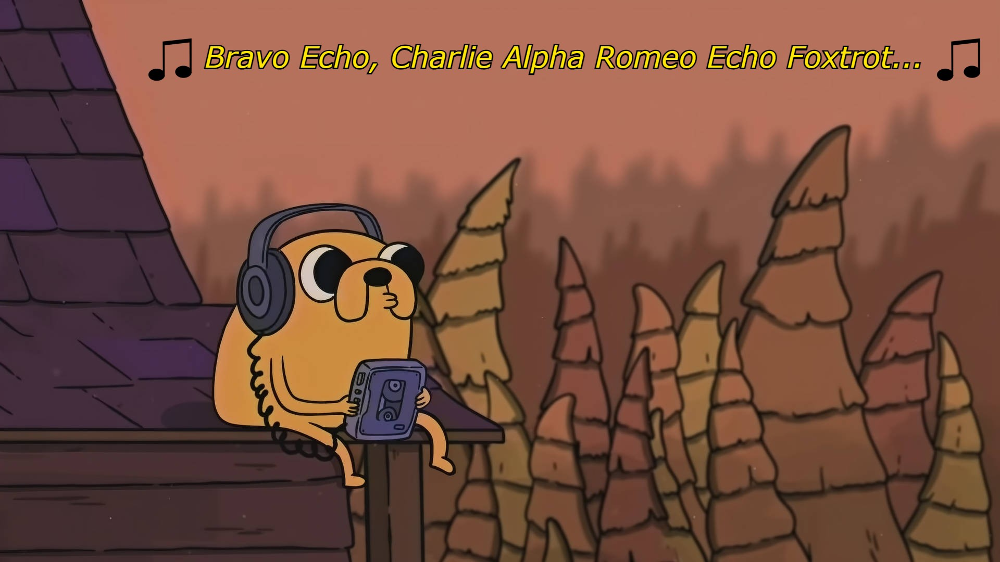

# Write-up TalkieNoWalkie

Le fichier transmis est un .iq, et après quelques recherches on détermine qu'il s'agit d'un signal complexe intercepté, reste à savoir quel type.
On l'ouvre dans GNU Radio et on le fait passer dans un GUI Sink pour l'observer un peu. On change aussi la fréquence d'échantillonage par celle donnée dans l'énoncé.

Ci-dessus un exemple de transmission AM : les fréquences sont réparties en bandes avec pour centre la fréquence de base (ici 0kHz).

Sur cet exemple de transmission FM, on peut voir une plus forte concentration en continu sur la fréquence de base, et une amplitude plus grande.

Quand on regarde le display de notre fichier IQ, il y a une forte concentration sur la fréquence de base et une grande amplitude, on peut donc en déduire que c'est de la FM.

A partir de là, on trouve le module GNU Radio de démodulation FM : WBFM Receive ou NBFM Receive peu importe. La quadrature rate vaut `sample_rate/4`, et la décimation est donc de 4 (d'autres valeurs marchent aussi mais donneront simplement une version accélerée ou ralentie en fonction). On sort le tout dans un ficher .wav, et notre workflow est prêt !

Dans l'audio, le flag nous est donné en utilisant l'alphabet OTAN :
"Bravo Echo (pause) Charlie Alfa Romeo Echo Foxtrot Uniform Lima (pause) Tango Oscar (pause) Whiskey Hotel Oscar (pause) India Sierra (pause) Lima India Sierra Tango Echo November India November Golf"

Ce qui, une fois mis en forme, nous donne le flag : NBCTF{be_careful_to_who_is_listening}

Le workflow est aussi dans ce dossier.

