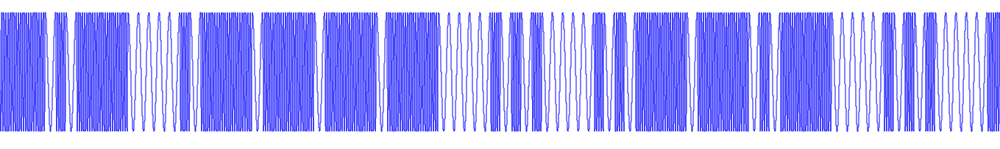
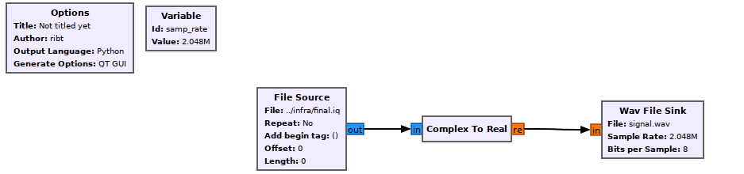
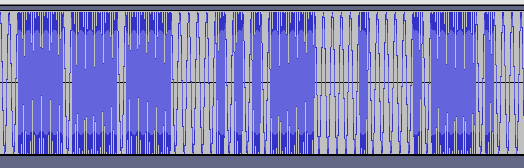

# Can you hear me?

## Énoncé 

Mon récepteur radio (RTL-SDR) capte un étrange signal. J'ai calibré mon récepteur pour que le signal soit le plus clair possible et j'ai utilisé l'outil `rtl_tcp` pour le diffuser sur le réseau. Pouvez-vous m'aider à le décoder ?
La fréquence d'échantillonnage est de 2 048 000 Hz.

L'indice vous explique le protocole utilisé, mais vous pouvez le deviner !

**Attention** : Le flag est en majuscule et au format `NBCTF(...)` (avec des parenthèses)

### Indice

Le texte est encodé en Morse. Voici les spécifications du signal :
* envoi d'un `.` : porteuse pure de fréquence 5kHz pendant 1 milliseconde,
* envoi d'un `-` : porteuse pure de fréquence 5kHz pendant 5 millisecondes,
* espacement entre deux lettres : porteuse pure de fréquence 1kHz pendant 5 millisecondes,
* espacement entre deux mots : porteuse pure de fréquence 1kHz pendant 20 millisecondes.

## Solve

### Première reconnaissance

La commande `nc <domain> 1234 | xxd` permet d'avoir un aperçu de ce qui passe. On voit des données avec une entropie assez importante. En lançant plusieurs fois la commande on peut voir que les données sont toujours identiques. En laissant tourner quelques secondes on constate également que l'émetteur arrête d'émettre au bout d'un moment.

On peut alors faire `nc <domain> 1234 > signal.iq` pour récupérer le fichier IQ de 21 Mo.

### Résolution

On peut ouvrir le signal dans GnuRadioCompanion et afficher le signal selon le temps :


On voit les deux porteuses à l'oeil nu : la plus rapide à 5 kHz et la plus lente à 1 kHz.

Pour parcourir tout le signal, il est par exemple possible d'utiliser ce graph GRC :


Cela permet de stocker le signal dans un fichier WAV qu'on peut ensuite ouvrir avec Audacity.

Le signal ressemble à du morse. On dirait qu'il est séparé en 3 parties. Regardons la dernière (la plus courte) :


En morse, cela donne  `--- ...- . .-.` soit `OVER`. L'hypothèse du morse est confirmée. On peut décoder tout le signal à la main ou chercher `NBCTF` (`-. -... -.-. - ..-.`) pour extraire seulement le flag.

À noter qu'il faut savoir décoder les caractères spéciaux comme défini par exemple sur [ce site](https://the-daily-dabble.com/morse-code-numbers-punctuation/).

On récupère le texte complet : 
```
WELCOME TO THIS AWESOME CHALLENGE
THE FLAG IS NBCTF(SDR_1S_S0000_C00L)
OVER
```

Il est évidemment possible de faire un script pour automatiser cela, l'exercice est laissé au lecteur ;)