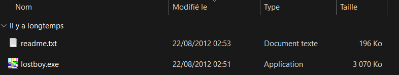

# Writeup Find My Game

On commence par essayer de trouver le nom du jeu. En recherchant "malware lost game 2012", on trouve "lostboy.exe". Il date effectivement de 2012, contenait bien un trojan, était bien un jeu chelou, et a bien été posté sur un forum : 4chan. On recherche ensuite "lostboy.exe" et là on tombe sur un truc très intéressant : une vidéo de Feldup sur le sujet.

En la regardant ou en cherchant un petit peu dans les autres résultats de recherche, on apprend qu'il a retrouvé le jeu en mai 2023 ! Plus qu'à aller dans la description de la vidéo, et télécharger le .rar depuis le lien mediafire. On l'extrait, et le fichier tant recherché par la communauté est devant nous !

"Modifié le 22/08/2012 02:51" si c'est pas beau ça. Pour générer le hash, sur Linux démmerdez-vous et sur Windows il suffit d'entrer `certutil -hashfile .\lostboy.exe SHA256` et ça nous donne le flag :
NBCTF{2639a5c730dc851207451ade1bc65c7b5f1e79151c17320e6825b77b585bcad8}

