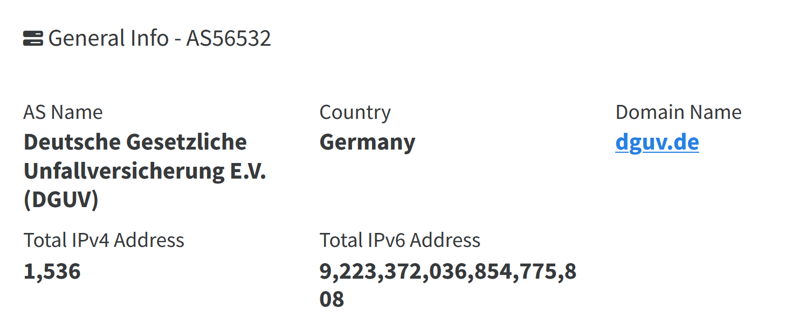
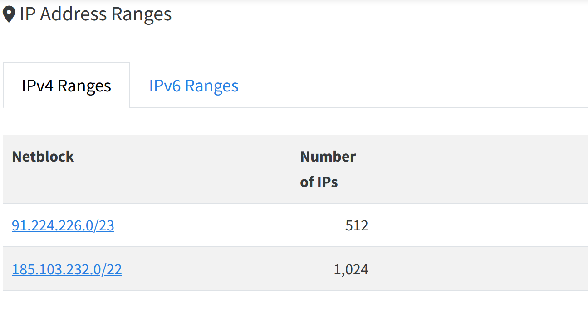

On fait la recherche Google suivante :
```
"Comment identifier les blocs réseau d'une entreprise"
```

En bas de la première page de résultat Google on trouve le lien suivant :
[Que sont les ASN ?](https://www.cloudflare.com/fr-fr/learning/network-layer/what-is-an-autonomous-system/)

On fait ensuite une recherche Google pour connaître l'AS de l'entreprise Deutsche Gesetzliche Unfallversicherung E.V. (DGUV) :
"asn Deutsche Gesetzliche Unfallversicherung E.V. (DGUV)"

Le numéro d'AS que l'on cherche est AS56532

Deuxième résultat de la recherche :
[ASN de Deutsche Gesetzliche Unfallversicherung E.V. (DGUV)](https://www.ip2location.com/as56532)

Résultat : 

