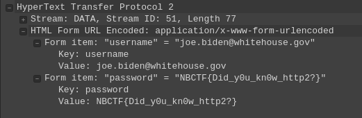

On ouvre le PCAPNG dans Wireshark. On voit des requêtes DNS vers le site de RedHat et peut de traffic. Cela est cohérent avec l'énoncé. Pour déchiffrer les paquets TLS on va dans `Editer > Préférences > Protocols > TLS` et on renseigne le chemin vers les logs SSL dans `Pre-Master-Secret log filename`.

On voit alors du traffic HTTP2. En parcourant les paquets HTTP2 on voit seulement 2 POST. L'un des deux est suivi par un paquet ayant pour commentaire `DATA[51] (application/x-www-form-urlencoded)`. Cela correspond à un POST de formulaire HTML donc probablement les infos de connexion. On déroule les menus avec Wireshark et on voit le flag :

Un CTRL+F de `NBCTF` permet également de trouver le flag une fois le traffic déchiffré.