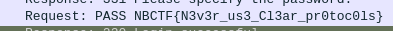

On ouvre la capture dans Wireshark. C'est un échange FTP, le flag est le mot de passe de connexion de l'utilisateur. On le voit directement dans l'affichage par défaut de Wireshark :

Les plus débrouillards sauront faire un copier-coller de la valeur dans les détails du paquet dans la partie basse de la fenêtre, sinon il est toujours possible de recopier le flag.