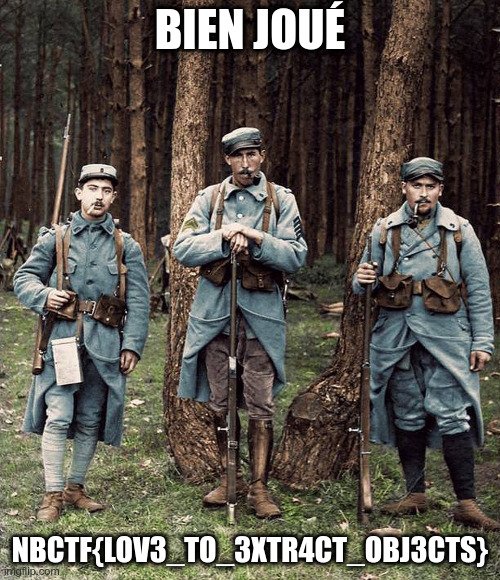

Le fichier est une capture composée de 822 paquets et comme indiqué c'est une session FTP. Le mot de passe est de nouveau en clair mais ce n'est pas le flag : `MyPasswordIsNotTheFlagThisTime`.

Un bon moyen de voir tout ce qui s'est passé est de faire un clic droit sur une trame FTP, `Suivre` > `Flux TCP`. On voit un peu de bruit (des changements de dossier courant) puis une énumération des fichiers. Ensuite un certain nombre de fichiers sont téléchargés. En observant attentivement, on peut voir que l'un des fichiers s'intitule `flag.jpg`.

Une autre solution pour le voir est de consulter le deuxième paquet "FTP-DATA" qui correspont au listing du dossier `/home/rpoincarre` :

```txt
drwxrwxr-x    2 1002     1000         4096 Oct 08 18:31 .
drwxr-xr-x    4 0        0            4096 Sep 04 20:18 ..
-rw-rw-r--    1 1000     1000       417330 Oct 08 18:29 0.jpg
-rw-rw-r--    1 1000     1000       273186 Oct 08 18:30 Sans-titre-22.jpg
-rw-rw-r--    1 1000     1000       238928 Oct 08 18:30 Sans-titre-28.jpg
-rw-rw-r--    1 1000     1000       343353 Oct 08 18:30 Sans-titre-49.jpg
-rw-rw-r--    1 1000     1000       581178 Oct 08 18:30 Sans-titre-51.jpg
-rw-rw-r--    1 1000     1000       359884 Oct 08 18:30 Sans-titre-53.jpg
-rw-rw-r--    1 1000     1000       302955 Oct 08 18:30 Sans-titre-54.jpg
-rw-rw-r--    1 1000     1000       159135 Oct 08 18:30 Sans-titre-55.jpg
-rw-rw-r--    1 1000     1000       448214 Oct 08 18:30 Sans-titre-59.jpg
-rw-rw-r--    1 1000     1000       388345 Oct 08 18:30 Sans-titre-60.jpg
-rw-rw-r--    1 1000     1000       235858 Oct 08 18:30 Sans-titre-61.jpg
-rw-rw-r--    1 1000     1000       144586 Oct 08 18:30 Sans-titre-62.jpg
-rw-rw-r--    1 1000     1000       226841 Oct 08 18:30 Sans-titre-64.jpg
-rw-rw-r--    1 1000     1000       589309 Oct 08 18:29 Sans-titre-65.jpg
-rw-rw-r--    1 1000     1000       318167 Oct 08 18:30 Sans-titre-66.jpg
-rw-rw-r--    1 1000     1000       348591 Oct 08 18:30 Sans-titre-69.jpg
-rw-rw-r--    1 1000     1000       216784 Oct 08 18:29 Sans-titre-72.jpg
-rw-r--r--    1 0        0          146563 Oct 08 18:27 flag.jpg
```

On peut alors par exemple mettre `tcp.payload contains "flag"` comme recherche dans Wireshark pour voir que le paquet 544 correspond à la demande de lecture de `flag.jpg`. On efface le filtre et on regarde le premier paquet "FTP-DATA" qui suit ce paquet 544. À nouveau clic droit, `Suivre` > `Flux TCP`. En bas à droite de la nouvelle fenêtre dans "Afficher les données comme", on choisit "Brut" puis on clique sur "Enregistrer sous". On nomme notre fichier "flag.jpg" et on peut enfin l'ouvrir :

